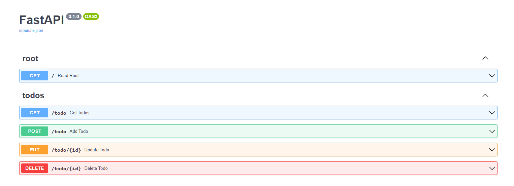
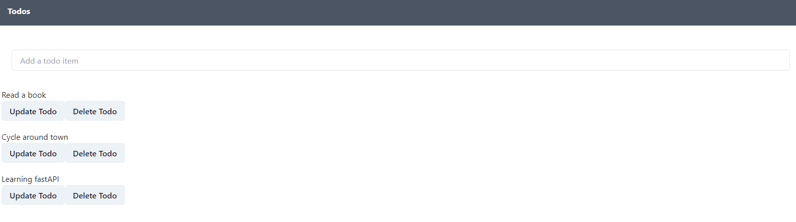

# SinglePage_fastAPI_react

Création d'une application à page unique via fastAPI et React. 

Pour lancer le projet, il suffit de lancer certaines commandes

Pour la partie backend, rendez vous sur [localhost:8000/](localhost:8000/)

````
$ cd backend
$ python -m venv env
$ python env/Scripts/activate
(env)$ pip install -r requirements.txt
(env)$ python main.py
````

Pour la partie frontend, rendez vous sur [localhost:3000/](localhost:3000/)

````
$ cd frontend
$ npm install
$ npm start
````

## Création d'une todo list

Différentes routes sont créées afin d'effectuer les manipulations du CRUD, à savoir :

- Afficher les données (READ) - *get*
- Créer de nouvelles données (CREATE) - *post*
- Mettre à jour les données (UPDATE) - *put*
- Supprimer les données (DELETE) - *delete*


